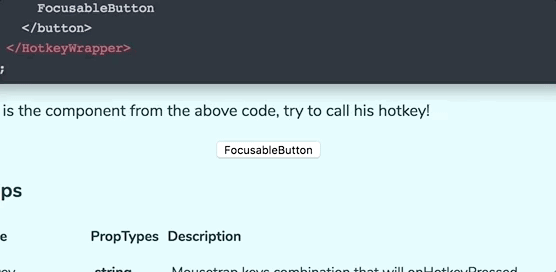

# react-hotkey-tooltip

[](https://greenkeeper.io/)
[](https://travis-ci.org/EmaSuriano/react-hotkey-tooltip)
[](https://www.npmjs.com/package/react-hotkey-tooltip)
[](https://coveralls.io/github/EmaSuriano/react-hotkey-tooltip)
[](http://commitizen.github.io/cz-cli/)
[](https://github.com/semantic-release/semantic-release)

A global Hotkey provider with built in tooltip for React. Demo at [Demo Page](https://emasuriano.github.io/react-hotkey-tooltip/).



## Why you should use it?

When working with hotkeys in a React application we will find many problems when trying to implement it:

* Hotkeys are only accesible inside a specific component (not globally).
* Must take care of the hotkeys manually throughout the life cycle.
* Have to provide a way so the user can see all the hotkeys on the screen.

This library will help you by declaring global hotkeys that automatically will be updated by any life cycle of the component and show a tooltip by pressing a combination of keys ✨

## Built with

Why mess up with document.addEventListener or positioning/styling tooltips if there are a lot of open source libraries that can do that for me. This are the chosen ones!

* [mousetrap](https://github.com/ccampbell/mousetrap): to bind and unbind hotkeys globally 🌐
* [react-tippy](https://github.com/tvkhoa/react-tippy): to display beautiful tooltips 😄

## Installation

```bash
  npm install react-hotkey-tooltip
```

## In action

```javascript
import React from 'react';
import HotkeyWrapper from 'react-hotkey-wrapper';

const FocusableButton = () => (
  <HotkeyWrapper
    hotkey="b"
    tooltipHotkey="h"
    onHotkeyPressed={() => this.button1.focus()}
  >
    <button onClick={() => console.log('click!')} ref={c => (this.button1 = c)}>
      FocusableButton
    </button>
  </HotkeyWrapper>
);
```

## Props

| Name            | PropTypes   | Description                                                                |
| --------------- | ----------- | -------------------------------------------------------------------------- |
| hotkey          | string      | Mousetrap keys combination that will onHotkeyPressed                       |
| onHotkeyPressed | func        | Function that will be called after the hotkey is pressed                   |
| children        | element     | React element in which one the tooltip will appear                         |
| tooltipHotkey   | string [?]  | Mousetrap keys combination that will show all tooltips                     |
| tooltipProps    | object [{}] | Passed to the Tooltip of react-tippy in order to modify it                 |
| disableTooltip  | bool        | [false] Disable the tooltip, so pressing tooltipHotkey will have no effect |

## License

MIT. Also check react-tippy.js' and mousetrap' license.
